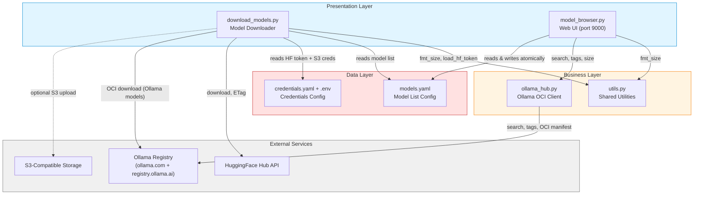

# Architecture Documentation — aihub

Generated: 2026-02-20 | Version: 1.0.0

## Overview

**aihub** is a Python CLI toolset for discovering, downloading, and managing open-source AI models from HuggingFace Hub and Ollama Registry, with support for S3-compatible object storage synchronization and a web-based management UI.

- **Pattern:** Layered architecture (Presentation / Business / Data / External)
- **Language:** Python 3.9+
- **Components:** 6 (2 CLI scripts, 1 web UI, 2 utility modules, 2 config files)
- **Entry points:** `download_models.py`, `model_browser.py`

---

## Component Dependency Graph

---

## Files

| File | Description |
|------|-------------|
| [overview.yaml](overview.yaml) | Full architecture specification: all components, dependencies, quality attributes, external integrations |
| [dependency-graph.yaml](dependency-graph.yaml) | Machine-readable dependency graph (nodes + edges) |
| [components/utils.yaml](components/utils.yaml) | Shared Utilities component spec |
| [components/download-models.yaml](components/download-models.yaml) | Model Downloader component spec |
| [components/ollama-hub.yaml](components/ollama-hub.yaml) | Ollama OCI Client component spec |
| [components/model-browser.yaml](components/model-browser.yaml) | Web UI Model Browser component spec |
| [diagrams/dependency-graph.md](diagrams/dependency-graph.md) | Mermaid dependency diagrams (component graph, Makefile mapping, credential chain) |
| [diagrams/data-flow-download.md](diagrams/data-flow-download.md) | Mermaid data flow diagrams (download pipeline, web UI save flow, Ollama download flow) |

---

## Architecture Layers

### Presentation Layer
Two CLI/web entry points, each callable via Makefile:

| Script | Makefile | Purpose |
|--------|----------|---------|
| `scripts/download_models.py` | `make download`, `make list` | Download AI models to local disk and/or S3 |
| `scripts/model_browser.py` | `make ui` | Web UI at http://localhost:9000 |

### Business Layer
- `scripts/utils.py` — `fmt_size()` and `load_hf_token()` shared utilities
- `scripts/ollama_hub.py` — Ollama OCI client: model search, tag listing, GGUF download, size lookup

### Data Layer
- `models.yaml` — model list with per-model metadata, read by downloader and web UI, written atomically by web UI
- `credentials.yaml` + `.env` — gitignored secret/config split (see security below)

### External Integrations
- **HuggingFace Hub** (`huggingface_hub`) — model discovery and file downloads with ETag support
- **Ollama Registry** (`requests`) — model search via `ollama.com`, tag listing, OCI manifest for GGUF size, HTTP-resume download from `registry.ollama.ai`
- **S3-Compatible Storage** (`boto3`) — AWS S3, MinIO, Yandex Object Storage, Cloudflare R2
- **hf_transfer** (optional) — Rust-based download acceleration

---

## Key Design Decisions

### Idempotent Downloads
ETag-based change detection with sidecar `.etag` files. Atomic writes via `tempfile.mkstemp` + `os.replace` prevent partial files on failure.

### Split Secret/Config Pattern
`credentials.yaml` holds secrets (tokens, keys). `.env` holds parameters (bucket, region, endpoint). Both are gitignored. Priority: credentials.yaml > .env > environment variables.

### Stdlib-Only Web Server
`model_browser.py` uses only `http.server`, `json`, `pathlib`, `tempfile`, and `os` from the standard library. No Flask, FastAPI, or other web framework dependency.

### S3 Abstraction
`S3Config.endpoint_url` supports any S3-compatible API. Empty = standard AWS; set for MinIO/Yandex/R2.

---

## Quality Attributes

| Attribute | Mechanism |
|-----------|-----------|
| Idempotency | ETag comparison, atomic writes, S3 size check |
| Reliability | Exponential backoff, HTTP 429 ×10 delay, finally-block cleanup |
| Security | Gitignored secrets, yaml.safe_load, localhost-only web server |
| Extensibility | S3 endpoint_url override, optional hf_transfer accelerator |
| Usability | Makefile targets, rich CLI help, web UI, YAML snippet output |
