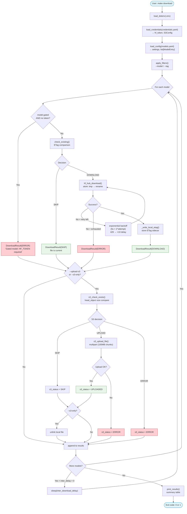
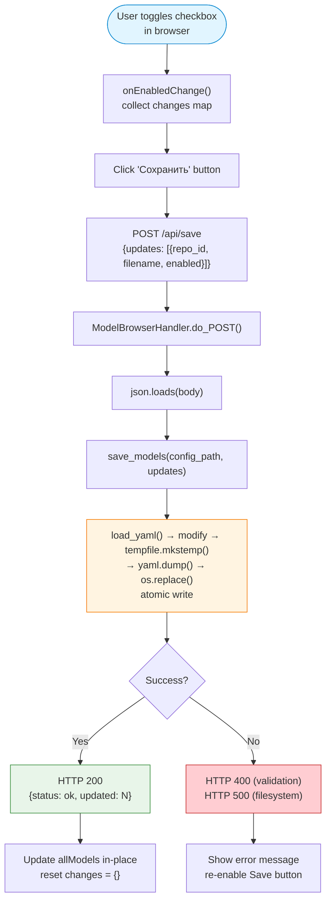

# Data Flow — Model Download Pipeline

Generated: 2026-02-20

## Full Download Flow (with S3 sync)

```mermaid
flowchart TD
    START([User: make download]) --> LOAD_ENV["load_dotenv(.env)"]
    LOAD_ENV --> LOAD_CREDS["load_credentials(credentials.yaml)\n→ hf_token, S3Config"]
    LOAD_CREDS --> LOAD_CONFIG["load_config(models.yaml)\n→ settings, list[ModelEntry]"]
    LOAD_CONFIG --> FILTER["apply_filters()\n--model / --tag"]
    FILTER --> LOOP{For each model}

    LOOP --> GATED{model.gated\nAND no token?}
    GATED -->|Yes| ERR_GATED["DownloadResult(ERROR)\n'Gated model: HF_TOKEN required'"]
    GATED -->|No| CHECK_EXIST["check_existing()\nETag comparison"]

    CHECK_EXIST --> SKIP_DEC{Decision}
    SKIP_DEC -->|SKIP| SKIP_RESULT["DownloadResult(SKIP)\nfile is current"]
    SKIP_DEC -->|DOWNLOAD| DOWNLOAD["hf_hub_download()\natom: tmp → rename"]

    DOWNLOAD --> DL_OK{Success?}
    DL_OK -->|No + retry left| WAIT["exponential backoff\n(5s × 2^attempt)\n429 → ×10 delay"]
    WAIT --> DOWNLOAD
    DL_OK -->|No + exhausted| ERR_DL["DownloadResult(ERROR)"]
    DL_OK -->|Yes| ETAG["_write_local_etag()\nstore ETag sidecar"]
    ETAG --> DL_RESULT["DownloadResult(DOWNLOAD)"]

    DL_RESULT --> USE_S3{--upload-s3\nor --s3-only?}
    SKIP_RESULT --> USE_S3
    ERR_GATED --> USE_S3
    ERR_DL --> USE_S3

    USE_S3 -->|No| COLLECT["append to results"]
    USE_S3 -->|Yes| S3_CHECK["s3_check_exists()\nhead_object size compare"]
    S3_CHECK --> S3_DEC{S3 decision}
    S3_DEC -->|SKIP| S3_SKIP["s3_status = SKIP"]
    S3_DEC -->|UPLOAD| S3_UP["s3_upload_file()\nmultipart (100MB chunks)"]
    S3_DEC -->|ERROR| S3_ERR["s3_status = ERROR"]
    S3_UP --> S3_OK{Upload OK?}
    S3_OK -->|Yes| S3_DONE["s3_status = UPLOADED"]
    S3_OK -->|No| S3_FAIL["s3_status = ERROR"]

    S3_SKIP --> S3_MODE{--s3-only?}
    S3_DONE --> S3_MODE
    S3_ERR --> COLLECT
    S3_FAIL --> COLLECT
    S3_MODE -->|Yes| DEL_LOCAL["unlink local file"]
    S3_MODE -->|No| COLLECT
    DEL_LOCAL --> COLLECT

    COLLECT --> NEXT_MODEL{More models?}
    NEXT_MODEL -->|Yes + inter_delay > 0| INTER_WAIT["sleep(inter_download_delay)"]
    INTER_WAIT --> LOOP
    NEXT_MODEL -->|Yes| LOOP
    NEXT_MODEL -->|No| PRINT["print_results()\nsummary table"]
    PRINT --> END([Exit code: 0 or 1])

    style START fill:#e1f5ff,stroke:#0288d1
    style END fill:#e1f5ff,stroke:#0288d1
    style ERR_GATED fill:#ffcdd2,stroke:#c62828
    style ERR_DL fill:#ffcdd2,stroke:#c62828
    style S3_ERR fill:#ffcdd2,stroke:#c62828
    style S3_FAIL fill:#ffcdd2,stroke:#c62828
    style SKIP_RESULT fill:#e8f5e9,stroke:#388e3c
    style DL_RESULT fill:#e8f5e9,stroke:#388e3c
    style S3_DONE fill:#e8f5e9,stroke:#388e3c
```

## Web UI Save Flow

```mermaid
flowchart TD
    USER([User toggles checkbox\nin browser]) --> JS_CHANGE["onEnabledChange()\ncollect changes map"]
    JS_CHANGE --> SAVE_BTN["Click 'Сохранить' button"]
    SAVE_BTN --> POST["POST /api/save\n{updates: [{repo_id, filename, enabled}]}"]
    POST --> HANDLER["ModelBrowserHandler.do_POST()"]
    HANDLER --> PARSE["json.loads(body)"]
    PARSE --> SAVE["save_models(config_path, updates)"]
    SAVE --> ATOM["load_yaml() → modify → tempfile.mkstemp()\n→ yaml.dump() → os.replace()\natomic write"]
    ATOM --> OK{Success?}
    OK -->|Yes| RESP_OK["HTTP 200\n{status: ok, updated: N}"]
    OK -->|No| RESP_ERR["HTTP 400 (validation)\nHTTP 500 (filesystem)"]
    RESP_OK --> UPDATE_JS["Update allModels in-place\nreset changes = {}"]
    RESP_ERR --> SHOW_ERR["Show error message\nre-enable Save button"]

    style USER fill:#e1f5ff,stroke:#0288d1
    style ATOM fill:#fff4e1,stroke:#f57c00
    style RESP_OK fill:#e8f5e9,stroke:#388e3c
    style RESP_ERR fill:#ffcdd2,stroke:#c62828
```
