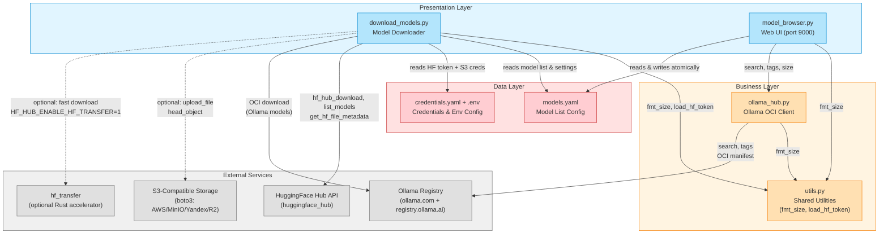
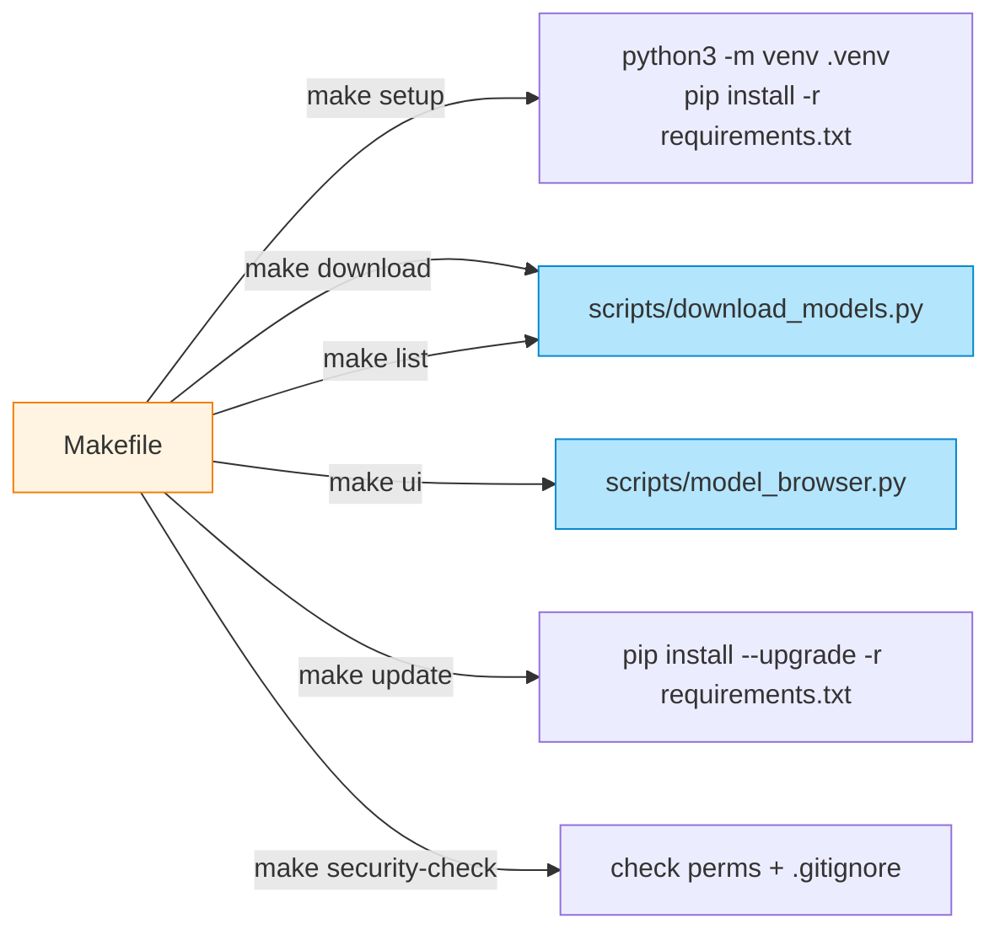
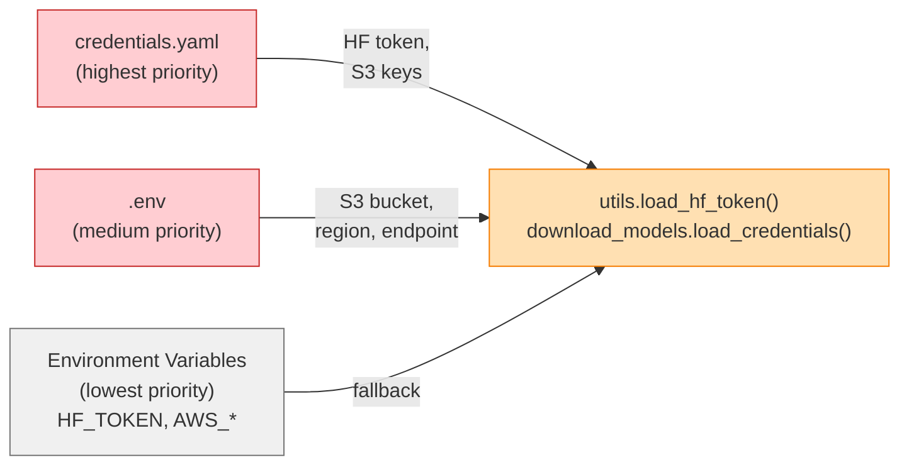

# Dependency Graph — aihub

Generated: 2026-02-20

## Component Dependency Graph

```mermaid
graph TD
    subgraph presentation["Presentation Layer"]
        DL["download_models.py\nModel Downloader"]
        MB["model_browser.py\nWeb UI (port 9000)"]
    end

    subgraph business["Business Layer"]
        UT["utils.py\nShared Utilities\n(fmt_size, load_hf_token)"]
        OH["ollama_hub.py\nOllama OCI Client"]
    end

    subgraph data["Data Layer"]
        MC["models.yaml\nModel List Config"]
        CC["credentials.yaml + .env\nCredentials & Env Config"]
    end

    subgraph external["External Services"]
        HF["HuggingFace Hub API\n(huggingface_hub)"]
        OL["Ollama Registry\n(ollama.com + registry.ollama.ai)"]
        S3["S3-Compatible Storage\n(boto3: AWS/MinIO/Yandex/R2)"]
        HFT["hf_transfer\n(optional Rust accelerator)"]
    end

    DL -->|"fmt_size, load_hf_token"| UT
    DL -->|"reads model list & settings"| MC
    DL -->|"reads HF token + S3 creds"| CC
    OH -->|"fmt_size"| UT
    MB -->|"fmt_size"| UT
    MB -->|"search, tags, size"| OH
    MB -->|"reads & writes atomically"| MC

    DL -->|"hf_hub_download, list_models\nget_hf_file_metadata"| HF
    DL -->|"OCI download\n(Ollama models)"| OL
    OH -->|"search, tags\nOCI manifest"| OL
    DL -.->|"optional: upload_file\nhead_object"| S3
    DL -.->|"optional: fast download\nHF_HUB_ENABLE_HF_TRANSFER=1"| HFT

    style presentation fill:#e1f5ff,stroke:#0288d1
    style business fill:#fff4e1,stroke:#f57c00
    style data fill:#ffe1e1,stroke:#c62828
    style external fill:#f0f0f0,stroke:#757575
    style DL fill:#b3e5fc,stroke:#0288d1
    style MB fill:#b3e5fc,stroke:#0288d1
    style UT fill:#ffe0b2,stroke:#f57c00
    style OH fill:#ffe0b2,stroke:#f57c00
    style MC fill:#ffcdd2,stroke:#c62828
    style CC fill:#ffcdd2,stroke:#c62828
    style HF fill:#e0e0e0,stroke:#757575
    style OL fill:#e0e0e0,stroke:#757575
    style S3 fill:#e0e0e0,stroke:#757575
    style HFT fill:#e0e0e0,stroke:#757575
```

## Makefile → Script Mapping

```mermaid
graph LR
    MK["Makefile"]
    MK -->|"make setup"| SETUP["python3 -m venv .venv\npip install -r requirements.txt"]
    MK -->|"make download"| DL["scripts/download_models.py"]
    MK -->|"make list"| DL
    MK -->|"make ui"| MB["scripts/model_browser.py"]
    MK -->|"make update"| UPDATE["pip install --upgrade -r requirements.txt"]
    MK -->|"make security-check"| SC["check perms + .gitignore"]

    style MK fill:#fff4e1,stroke:#f57c00
    style DL fill:#b3e5fc,stroke:#0288d1
    style MB fill:#b3e5fc,stroke:#0288d1
```

## Credential Resolution Chain

```mermaid
graph LR
    A["credentials.yaml\n(highest priority)"] -->|"HF token,\nS3 keys"| UT["utils.load_hf_token()\ndownload_models.load_credentials()"]
    B[".env\n(medium priority)"] -->|"S3 bucket,\nregion, endpoint"| UT
    C["Environment Variables\n(lowest priority)\nHF_TOKEN, AWS_*"] -->|"fallback"| UT

    style A fill:#ffcdd2,stroke:#c62828
    style B fill:#ffcdd2,stroke:#c62828
    style C fill:#f0f0f0,stroke:#757575
    style UT fill:#ffe0b2,stroke:#f57c00
```
